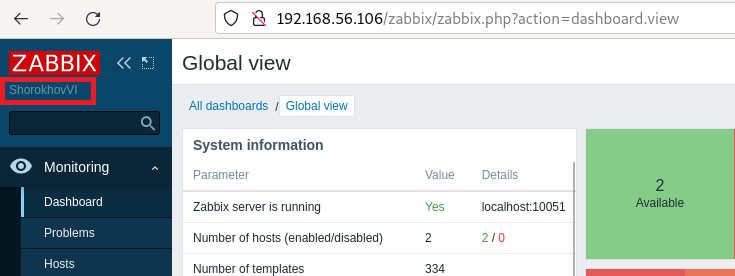
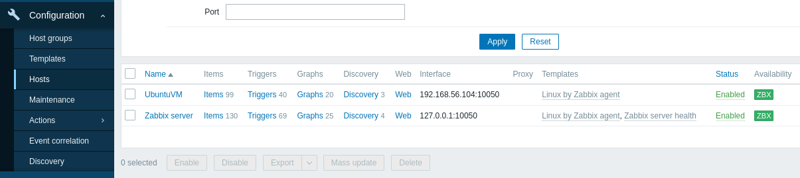
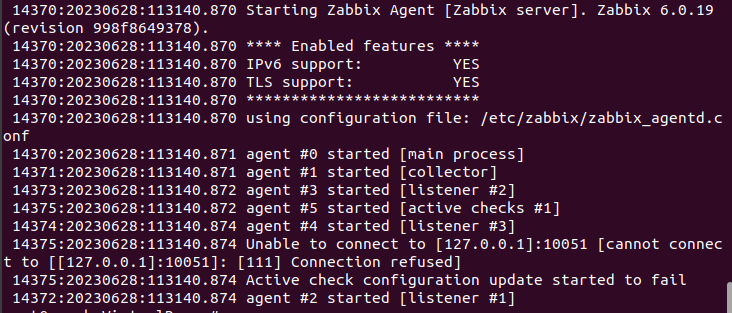
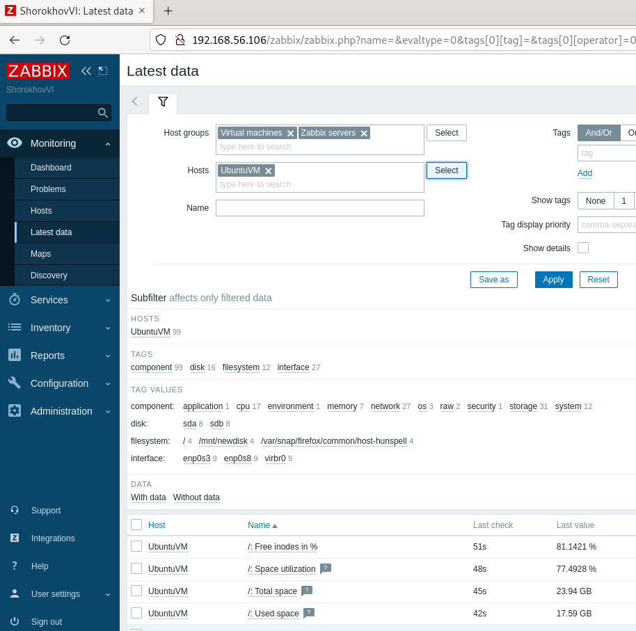
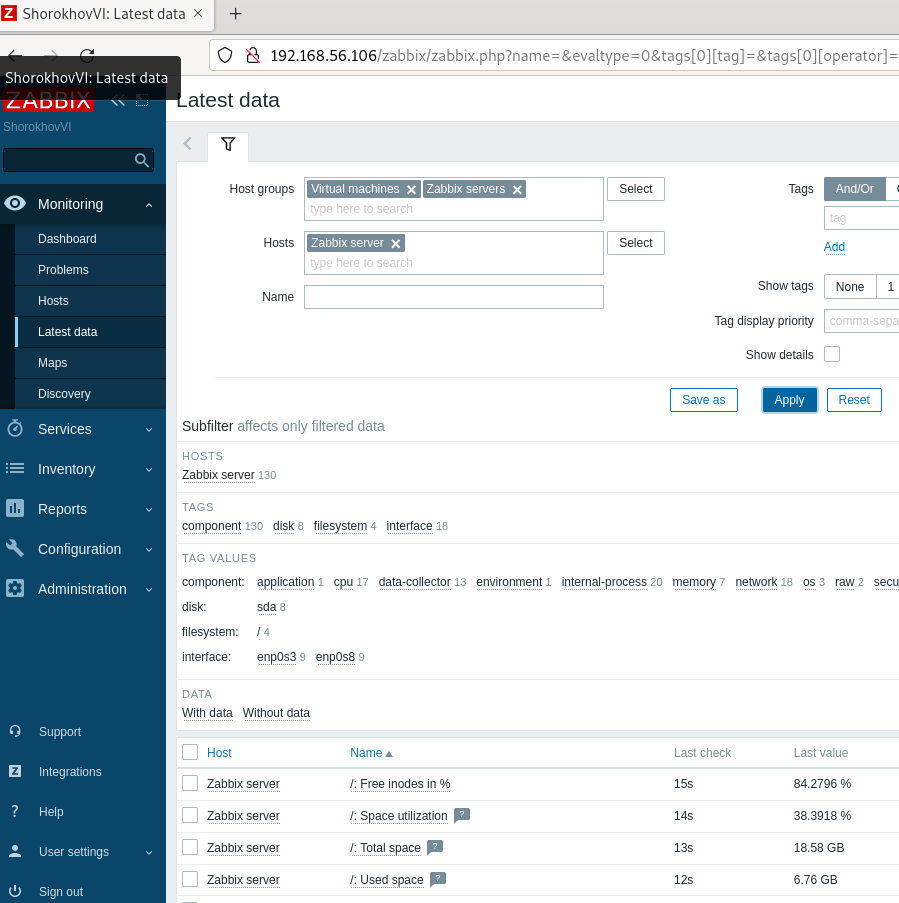

# Домашнее задание к занятию "`Система мониторинга Zabbix`" - `Шорохов Вячеслав`

---

### Задание 1
Установите Zabbix Server с веб-интерфейсом.

#### Требования к результаты

1. Прикрепите в файл README.md скриншот авторизации в админке
2. Приложите в файл README.md текст использованных команд в GitHub

`Использовал конфигуратор команд для установки сервера с сайта zabbix`

```
Установите репозиторий Zabbix
# wget https://repo.zabbix.com/zabbix/6.0/debian/pool/main/z/zabbix-release/zabbix-release_6.0-4+debian11_all.deb
# dpkg -i zabbix-release_6.0-4+debian11_all.deb
# apt update

Установите Zabbix сервер, веб-интерфейс и агент
# apt install zabbix-server-pgsql zabbix-frontend-php php7.4-pgsql zabbix-apache-conf zabbix-sql-scripts zabbix-agent

Установите и запустите сервер базы данных.
# sudo -u postgres createuser --pwprompt zabbix
# sudo -u postgres createdb -O zabbix zabbix

На хосте Zabbix сервера импортируйте начальную схему и данные.
# zcat /usr/share/zabbix-sql-scripts/postgresql/server.sql.gz | sudo -u zabbix psql zabbix

Отредактируйте файл /etc/zabbix/zabbix_server.conf
DBPassword=password

Запустите процессы Zabbix сервера и агента и настройте их запуск при загрузке ОС.
# systemctl restart zabbix-server zabbix-agent apache2
# systemctl enable zabbix-server zabbix-agent apache2
```

`Скриншот авторизации в админке веб-интерфейса:
`


---

### Задание 2

Установите Zabbix Agent на два хоста.

#### Требования к результаты

1. Приложите в файл README.md скриншот раздела Configuration > Hosts, где видно, что агенты подключены к серверу
2. Приложите в файл README.md скриншот лога zabbix agent, где видно, что он работает с сервером
3. Приложите в файл README.md скриншот раздела Monitoring > Latest data для обоих хостов, где видны поступающие от агентов данные.
4. Приложите в файл README.md текст использованных команд в GitHub


`Использовал конфигуратор команд для установки агента с сайта zabbix`

```
Установите репозиторий Zabbix
# wget https://repo.zabbix.com/zabbix/6.0/ubuntu/pool/main/z/zabbix-release/zabbix-release_6.0-4+ubuntu22.04_all.deb
# dpkg -i zabbix-release_6.0-4+ubuntu22.04_all.deb
# apt update

Установите Zabbix агент
# apt install zabbix-agent

Запустите процесс Zabbix агента
# systemctl restart zabbix-agent
# systemctl enable zabbix-agent
```

`скриншот раздела Configuration > Hosts, где видно, что агенты подключены к серверу:
`

`скриншот лога zabbix agent, где видно, что он работает с сервером:
`

`скриншот раздела Monitoring > Latest data для обоих хостов, где видны поступающие от агентов данные (UbuntuVM):
`

`скриншот раздела Monitoring > Latest data для обоих хостов, где видны поступающие от агентов данные (Zabbix server):
`


---

